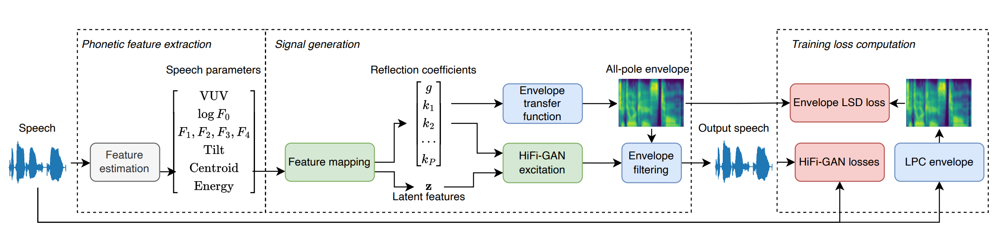

# HiFi-Glot: Neural formant synthesis with differentiable resonant filters

##### [Lauri Juvela][lauri_profile], [Pablo Pérez Zarazaga][pablo_profile], [Gustav Eje Henter][gustav_profile], [Zofia Malisz][zofia_profile]

<head> 
<link rel="apple-touch-icon" sizes="180x180" href="favicon/apple-touch-icon.png">
<link rel="icon" type="image/png" sizes="32x32" href="favicon/favicon-32x32.png">
<link rel="icon" type="image/png" sizes="16x16" href="favicon/favicon-16x16.png">
<link rel="manifest" href="/site.webmanifest">
<link rel="mask-icon" href="/safari-pinned-tab.svg" color="#5bbad5">
<meta name="msapplication-TileColor" content="#da532c">
<meta name="theme-color" content="#ffffff">
</head>

[NF_link]: https://github.com/ljuvela/SourceFilterNeuralFormants
[paper_link]: http://arxiv.org/abs/2306.01957
[gustav_profile]: https://people.kth.se/~ghe/
[pablo_profile]: https://orcid.org/0000-0002-6166-9061
[zofia_profile]: https://www.kth.se/profile/malisz
[lauri_profile]: https://research.aalto.fi/en/persons/lauri-juvela

[hifi_link]: https://github.com/jik876/hifi-gan
[GN_link]: https://github.com/ljuvela/GlotNet
[NF_paper]: https://arxiv.org/abs/2303.07442

## Summary

The goal of this work is to develop a speaker-independent speech synthesis system driven by a small set of phonetically meaningful speech parameters.

The system is built with a similar structure to the source-filter model, allowing us to independently inspect and manipulate the spectral envelope and glottal excitation.

The system provides a controllable environment where it is possible to manipulate the different individual speech parameters to generate a realistic speech signal.

## Visual overview

## Code

Source code and pre-trained models can be found following the instructions in [our repository][NF_link]

## Synthesised speech

We first present some samples generated as copy synthesis with the proposed HiFi-Glot model compared to [previous iterations of the model][NF_paper] (NFS), an end-to-end implementation of this model (NFS-E3E) and Praat.

<table class="tg">
  <thead>
    <tr>
      <th class="tg-0pky">System</th>
      <th class="tg-0pky" colspan="1">Reference</th>
      <th class="tg-0pky" colspan="1">HiFi-GLot</th>
      <th class="tg-0pky" colspan="1">NFS-E2E</th>
      <th class="tg-0pky" colspan="1">NFS</th>
      <th class="tg-0pky" colspan="1">Praat</th>
    </tr>
  </thead>
  <tbody>
    <tr>
      <td nowrap="" class="tg-0pky"><b>Sample 1</b></td>
      <td class="tg-0pky">
        <audio id="audio-small" controls="">
          <source src="./Samples/SFNeuralFormants/ltest/p259_426_mic1_orig_1.0_1.0_1.0_1.0_1.0.wav" type="audio/wav" preload=none/>
        </audio>
      </td>
      <td class="tg-0pky">
        <audio id="audio-small" controls="">
          <source src="./Samples/SFNeuralFormants/ltest/p259_426_mic1_23_1.0_1.0_1.0_1.0_1.0.wav" type="audio/wav" preload=none/>
        </audio>
      </td>
      <td class="tg-0pky">
        <audio id="audio-small" controls="">
          <source src="./Samples/SFNeuralFormants/ltest/p259_426_mic1_25_1.0_1.0_1.0_1.0_1.0.wav" type="audio/wav" preload=none/>
        </audio>
      </td>
      <td class="tg-0pky">
        <audio id="audio-small" controls="">
          <source src="./Samples/SFNeuralFormants/ltest/p259_426_mic1_26_1.0_1.0_1.0_1.0_1.0.wav" type="audio/wav" preload=none/>
        </audio>
      </td>
      <td class="tg-0pky">
        <audio id="audio-small" controls="">
          <source src="./Samples/SFNeuralFormants/ltest/p259_426_mic1_praat_1.0_1.0_1.0_1.0_1.0.wav" type="audio/wav" preload=none/>
        </audio>
      </td>
    </tr>
  </tbody>
  <tbody>
    <tr>
      <td nowrap="" class="tg-0pky"><b>Sample 2</b></td>
      <td class="tg-0pky">
        <audio id="audio-small" controls="">
          <source src="./Samples/SFNeuralFormants/ltest/p273_128_mic1_orig_1.0_1.0_1.0_1.0_1.0.wav" type="audio/wav" preload=none/>
        </audio>
      </td>
      <td class="tg-0pky">
        <audio id="audio-small" controls="">
          <source src="./Samples/SFNeuralFormants/ltest/p273_128_mic1_23_1.0_1.0_1.0_1.0_1.0.wav" type="audio/wav" preload=none/>
        </audio>
      </td>
      <td class="tg-0pky">
        <audio id="audio-small" controls="">
          <source src="./Samples/SFNeuralFormants/ltest/p273_128_mic1_25_1.0_1.0_1.0_1.0_1.0.wav" type="audio/wav" preload=none/>
        </audio>
      </td>
      <td class="tg-0pky">
        <audio id="audio-small" controls="">
          <source src="./Samples/SFNeuralFormants/ltest/p273_128_mic1_26_1.0_1.0_1.0_1.0_1.0.wav" type="audio/wav" preload=none/>
        </audio>
      </td>
      <td class="tg-0pky">
        <audio id="audio-small" controls="">
          <source src="./Samples/SFNeuralFormants/ltest/p273_128_mic1_praat_1.0_1.0_1.0_1.0_1.0.wav" type="audio/wav" preload=none/>
        </audio>
      </td>
    </tr>
  </tbody>
  <tbody>
    <tr>
      <td nowrap="" class="tg-0pky"><b>Sample 3</b></td>
      <td class="tg-0pky">
        <audio id="audio-small" controls="">
          <source src="./Samples/SFNeuralFormants/ltest/p303_157_mic1_orig_1.0_1.0_1.0_1.0_1.0.wav" type="audio/wav" preload=none/>
        </audio>
      </td>
      <td class="tg-0pky">
        <audio id="audio-small" controls="">
          <source src="./Samples/SFNeuralFormants/ltest/p303_157_mic1_23_1.0_1.0_1.0_1.0_1.0.wav" type="audio/wav" preload=none/>
        </audio>
      </td>
      <td class="tg-0pky">
        <audio id="audio-small" controls="">
          <source src="./Samples/SFNeuralFormants/ltest/p303_157_mic1_25_1.0_1.0_1.0_1.0_1.0.wav" type="audio/wav" preload=none/>
        </audio>
      </td>
      <td class="tg-0pky">
        <audio id="audio-small" controls="">
          <source src="./Samples/SFNeuralFormants/ltest/p303_157_mic1_26_1.0_1.0_1.0_1.0_1.0.wav" type="audio/wav" preload=none/>
        </audio>
      </td>
      <td class="tg-0pky">
        <audio id="audio-small" controls="">
          <source src="./Samples/SFNeuralFormants/ltest/p303_157_mic1_praat_1.0_1.0_1.0_1.0_1.0.wav" type="audio/wav" preload=none/>
        </audio>
      </td>
    </tr>
  </tbody>
</table>

<!--
Manipulation samples are created by scaling a specific formant frequency (F1-F4) by a factor in the range 0.7 - 1.3.

<table class="tg">
  <thead>
    <tr>
      <th class="tg-0pky">Scale F1</th>
      <th class="tg-0pky" colspan="1">0.7</th>
      <th class="tg-0pky" colspan="1">0.8</th>
      <th class="tg-0pky" colspan="1">0.9</th>
      <th class="tg-0pky" colspan="1">1.0</th>
      <th class="tg-0pky" colspan="1">1.1</th>
      <th class="tg-0pky" colspan="1">1.2</th>
      <th class="tg-0pky" colspan="1">1.3</th>
    </tr>
  </thead>
  <tbody>
    <tr>
      <td nowrap="" class="tg-0pky"><b>NF HiFi-GAN</b></td>
      <td class="tg-0pky">
        <audio id="audio-small" controls="">
          <source src="./Samples/DDSPNF_manipulation/p282_101_mic1_NF_1.0_0.7_1.0_1.0_1.0.wav" type="audio/wav" preload="none"/>
        </audio>
      </td>
      <td class="tg-0pky">
        <audio id="audio-small" controls="">
          <source src="./Samples/DDSPNF_manipulation/p282_101_mic1_NF_1.0_0.8_1.0_1.0_1.0.wav" type="audio/wav" preload="none"/>
        </audio>
      </td>
      <td class="tg-0pky">
        <audio id="audio-small" controls="">
          <source src="./Samples/DDSPNF_manipulation/p282_101_mic1_NF_1.0_0.9_1.0_1.0_1.0.wav" type="audio/wav" preload="none"/>
        </audio>
      </td>
      <td class="tg-0pky">
        <audio id="audio-small" controls="">
          <source src="./Samples/DDSPNF_manipulation/p282_101_mic1_NF_1.0_1.0_1.0_1.0_1.0.wav" type="audio/wav" preload="none"/>
        </audio>
      </td>
      <td class="tg-0pky">
        <audio id="audio-small" controls="">
          <source src="./Samples/DDSPNF_manipulation/p282_101_mic1_NF_1.0_1.1_1.0_1.0_1.0.wav" type="audio/wav" preload="none"/>
        </audio>
      </td>
      <td class="tg-0pky">
        <audio id="audio-small" controls="">
          <source src="./Samples/DDSPNF_manipulation/p282_101_mic1_NF_1.0_1.2_1.0_1.0_1.0.wav" type="audio/wav" preload="none"/>
        </audio>
      </td>
      <td class="tg-0pky">
        <audio id="audio-small" controls="">
          <source src="./Samples/DDSPNF_manipulation/p282_101_mic1_NF_1.0_1.3_1.0_1.0_1.0.wav" type="audio/wav" preload="none"/>
        </audio>
      </td>
    </tr>
    <tr>
      <td nowrap="" class="tg-0pky"><b>Proposed method</b></td>
      <td class="tg-0pky">
        <audio id="audio-small" controls="">
          <source src="./Samples/DDSPNF_manipulation/p282_101_mic1_wave_1.0_0.7_1.0_1.0_1.0.wav" type="audio/wav" preload="none"/>
        </audio>
      </td>
      <td class="tg-0pky">
        <audio id="audio-small" controls="">
          <source src="./Samples/DDSPNF_manipulation/p282_101_mic1_wave_1.0_0.8_1.0_1.0_1.0.wav" type="audio/wav" preload="none"/>
        </audio>
      </td>
      <td class="tg-0pky">
        <audio id="audio-small" controls="">
          <source src="./Samples/DDSPNF_manipulation/p282_101_mic1_wave_1.0_0.9_1.0_1.0_1.0.wav" type="audio/wav" preload="none"/>
        </audio>
      </td>
      <td class="tg-0pky">
        <audio id="audio-small" controls="">
          <source src="./Samples/DDSPNF_manipulation/p282_101_mic1_wave_1.0_1.0_1.0_1.0_1.0.wav" type="audio/wav" preload="none"/>
        </audio>
      </td>
      <td class="tg-0pky">
        <audio id="audio-small" controls="">
          <source src="./Samples/DDSPNF_manipulation/p282_101_mic1_wave_1.0_1.1_1.0_1.0_1.0.wav" type="audio/wav" preload="none"/>
        </audio>
      </td>
      <td class="tg-0pky">
        <audio id="audio-small" controls="">
          <source src="./Samples/DDSPNF_manipulation/p282_101_mic1_wave_1.0_1.2_1.0_1.0_1.0.wav" type="audio/wav" preload="none"/>
        </audio>
      </td>
      <td class="tg-0pky">
        <audio id="audio-small" controls="">
          <source src="./Samples/DDSPNF_manipulation/p282_101_mic1_wave_1.0_1.3_1.0_1.0_1.0.wav" type="audio/wav" preload="none"/>
        </audio>
      </td>
    </tr>
    <tr>
      <td nowrap="" class="tg-0pky"><b>Praat</b></td>
      <td class="tg-0pky">
        <audio id="audio-small" controls="">
          <source src="./Samples/DDSPNF_manipulation/p282_101_mic1_praat_1.0_0.7_1.0_1.0_1.0.wav" type="audio/wav" preload="none"/>
        </audio>
      </td>
      <td class="tg-0pky">
        <audio id="audio-small" controls="">
          <source src="./Samples/DDSPNF_manipulation/p282_101_mic1_praat_1.0_0.8_1.0_1.0_1.0.wav" type="audio/wav" preload="none"/>
        </audio>
      </td>
      <td class="tg-0pky">
        <audio id="audio-small" controls="">
          <source src="./Samples/DDSPNF_manipulation/p282_101_mic1_praat_1.0_0.9_1.0_1.0_1.0.wav" type="audio/wav" preload="none"/>
        </audio>
      </td>
      <td class="tg-0pky">
        <audio id="audio-small" controls="">
          <source src="./Samples/DDSPNF_manipulation/p282_101_mic1_praat_1.0_1.0_1.0_1.0_1.0.wav" type="audio/wav" preload="none"/>
        </audio>
      </td>
      <td class="tg-0pky">
        <audio id="audio-small" controls="">
          <source src="./Samples/DDSPNF_manipulation/p282_101_mic1_praat_1.0_1.1_1.0_1.0_1.0.wav" type="audio/wav" preload="none"/>
        </audio>
      </td>
      <td class="tg-0pky">
        <audio id="audio-small" controls="">
          <source src="./Samples/DDSPNF_manipulation/p282_101_mic1_praat_1.0_1.2_1.0_1.0_1.0.wav" type="audio/wav" preload="none"/>
        </audio>
      </td>
      <td class="tg-0pky">
        <audio id="audio-small" controls="">
          <source src="./Samples/DDSPNF_manipulation/p282_101_mic1_praat_1.0_1.3_1.0_1.0_1.0.wav" type="audio/wav" preload="none"/>
        </audio>
      </td>
    </tr>
  </tbody>
</table>

<table class="tg">
  <thead>
    <tr>
      <th class="tg-0pky">Scale F2</th>
      <th class="tg-0pky" colspan="1">0.7</th>
      <th class="tg-0pky" colspan="1">0.8</th>
      <th class="tg-0pky" colspan="1">0.9</th>
      <th class="tg-0pky" colspan="1">1.0</th>
      <th class="tg-0pky" colspan="1">1.1</th>
      <th class="tg-0pky" colspan="1">1.2</th>
      <th class="tg-0pky" colspan="1">1.3</th>
    </tr>
  </thead>
  <tbody>
    <tr>
      <td nowrap="" class="tg-0pky"><b>NF HiFi-GAN</b></td>
      <td class="tg-0pky">
        <audio id="audio-small" controls="">
          <source src="./Samples/DDSPNF_manipulation/p282_101_mic1_NF_1.0_1.0_0.7_1.0_1.0.wav" type="audio/wav" preload="none"/>
        </audio>
      </td>
      <td class="tg-0pky">
        <audio id="audio-small" controls="">
          <source src="./Samples/DDSPNF_manipulation/p282_101_mic1_NF_1.0_1.0_0.8_1.0_1.0.wav" type="audio/wav" preload="none"/>
        </audio>
      </td>
      <td class="tg-0pky">
        <audio id="audio-small" controls="">
          <source src="./Samples/DDSPNF_manipulation/p282_101_mic1_NF_1.0_1.0_0.9_1.0_1.0.wav" type="audio/wav" preload="none"/>
        </audio>
      </td>
      <td class="tg-0pky">
        <audio id="audio-small" controls="">
          <source src="./Samples/DDSPNF_manipulation/p282_101_mic1_NF_1.0_1.0_1.0_1.0_1.0.wav" type="audio/wav" preload="none"/>
        </audio>
      </td>
      <td class="tg-0pky">
        <audio id="audio-small" controls="">
          <source src="./Samples/DDSPNF_manipulation/p282_101_mic1_NF_1.0_1.0_1.1_1.0_1.0.wav" type="audio/wav" preload="none"/>
        </audio>
      </td>
      <td class="tg-0pky">
        <audio id="audio-small" controls="">
          <source src="./Samples/DDSPNF_manipulation/p282_101_mic1_NF_1.0_1.0_1.2_1.0_1.0.wav" type="audio/wav" preload="none"/>
        </audio>
      </td>
      <td class="tg-0pky">
        <audio id="audio-small" controls="">
          <source src="./Samples/DDSPNF_manipulation/p282_101_mic1_NF_1.0_1.0_1.3_1.0_1.0.wav" type="audio/wav" preload="none"/>
        </audio>
      </td>
    </tr>
    <tr>
      <td nowrap="" class="tg-0pky"><b>Proposed method</b></td>
      <td class="tg-0pky">
        <audio id="audio-small" controls="">
          <source src="./Samples/DDSPNF_manipulation/p282_101_mic1_wave_1.0_1.0_0.7_1.0_1.0.wav" type="audio/wav" preload="none"/>
        </audio>
      </td>
      <td class="tg-0pky">
        <audio id="audio-small" controls="">
          <source src="./Samples/DDSPNF_manipulation/p282_101_mic1_wave_1.0_1.0_0.8_1.0_1.0.wav" type="audio/wav" preload="none"/>
        </audio>
      </td>
      <td class="tg-0pky">
        <audio id="audio-small" controls="">
          <source src="./Samples/DDSPNF_manipulation/p282_101_mic1_wave_1.0_1.0_0.9_1.0_1.0.wav" type="audio/wav" preload="none"/>
        </audio>
      </td>
      <td class="tg-0pky">
        <audio id="audio-small" controls="">
          <source src="./Samples/DDSPNF_manipulation/p282_101_mic1_wave_1.0_1.0_1.0_1.0_1.0.wav" type="audio/wav" preload="none"/>
        </audio>
      </td>
      <td class="tg-0pky">
        <audio id="audio-small" controls="">
          <source src="./Samples/DDSPNF_manipulation/p282_101_mic1_wave_1.0_1.0_1.1_1.0_1.0.wav" type="audio/wav" preload="none"/>
        </audio>
      </td>
      <td class="tg-0pky">
        <audio id="audio-small" controls="">
          <source src="./Samples/DDSPNF_manipulation/p282_101_mic1_wave_1.0_1.0_1.2_1.0_1.0.wav" type="audio/wav" preload="none"/>
        </audio>
      </td>
      <td class="tg-0pky">
        <audio id="audio-small" controls="">
          <source src="./Samples/DDSPNF_manipulation/p282_101_mic1_wave_1.0_1.0_1.3_1.0_1.0.wav" type="audio/wav" preload="none"/>
        </audio>
      </td>
    </tr>
    <tr>
      <td nowrap="" class="tg-0pky"><b>Praat</b></td>
      <td class="tg-0pky">
        <audio id="audio-small" controls="">
          <source src="./Samples/DDSPNF_manipulation/p282_101_mic1_praat_1.0_1.0_0.7_1.0_1.0.wav" type="audio/wav" preload="none"/>
        </audio>
      </td>
      <td class="tg-0pky">
        <audio id="audio-small" controls="">
          <source src="./Samples/DDSPNF_manipulation/p282_101_mic1_praat_1.0_1.0_0.8_1.0_1.0.wav" type="audio/wav" preload="none"/>
        </audio>
      </td>
      <td class="tg-0pky">
        <audio id="audio-small" controls="">
          <source src="./Samples/DDSPNF_manipulation/p282_101_mic1_praat_1.0_1.0_0.9_1.0_1.0.wav" type="audio/wav" preload="none"/>
        </audio>
      </td>
      <td class="tg-0pky">
        <audio id="audio-small" controls="">
          <source src="./Samples/DDSPNF_manipulation/p282_101_mic1_praat_1.0_1.0_1.0_1.0_1.0.wav" type="audio/wav" preload="none"/>
        </audio>
      </td>
      <td class="tg-0pky">
        <audio id="audio-small" controls="">
          <source src="./Samples/DDSPNF_manipulation/p282_101_mic1_praat_1.0_1.0_1.1_1.0_1.0.wav" type="audio/wav" preload="none"/>
        </audio>
      </td>
      <td class="tg-0pky">
        <audio id="audio-small" controls="">
          <source src="./Samples/DDSPNF_manipulation/p282_101_mic1_praat_1.0_1.0_1.2_1.0_1.0.wav" type="audio/wav" preload="none"/>
        </audio>
      </td>
      <td class="tg-0pky">
        <audio id="audio-small" controls="">
          <source src="./Samples/DDSPNF_manipulation/p282_101_mic1_praat_1.0_1.0_1.3_1.0_1.0.wav" type="audio/wav" preload="none"/>
        </audio>
      </td>
    </tr>
  </tbody>
</table>

<table class="tg">
  <thead>
    <tr>
      <th class="tg-0pky">Scale F3</th>
      <th class="tg-0pky" colspan="1">0.7</th>
      <th class="tg-0pky" colspan="1">0.8</th>
      <th class="tg-0pky" colspan="1">0.9</th>
      <th class="tg-0pky" colspan="1">1.0</th>
      <th class="tg-0pky" colspan="1">1.1</th>
      <th class="tg-0pky" colspan="1">1.2</th>
      <th class="tg-0pky" colspan="1">1.3</th>
    </tr>
  </thead>
  <tbody>
    <tr>
      <td nowrap="" class="tg-0pky"><b>NF HiFi-GAN</b></td>
      <td class="tg-0pky">
        <audio id="audio-small" controls="">
          <source src="./Samples/DDSPNF_manipulation/p282_101_mic1_NF_1.0_1.0_1.0_0.7_1.0.wav" type="audio/wav" preload="none"/>
        </audio>
      </td>
      <td class="tg-0pky">
        <audio id="audio-small" controls="">
          <source src="./Samples/DDSPNF_manipulation/p282_101_mic1_NF_1.0_1.0_1.0_0.8_1.0.wav" type="audio/wav" preload="none"/>
        </audio>
      </td>
      <td class="tg-0pky">
        <audio id="audio-small" controls="">
          <source src="./Samples/DDSPNF_manipulation/p282_101_mic1_NF_1.0_1.0_1.0_0.9_1.0.wav" type="audio/wav" preload="none"/>
        </audio>
      </td>
      <td class="tg-0pky">
        <audio id="audio-small" controls="">
          <source src="./Samples/DDSPNF_manipulation/p282_101_mic1_NF_1.0_1.0_1.0_1.0_1.0.wav" type="audio/wav" preload="none"/>
        </audio>
      </td>
      <td class="tg-0pky">
        <audio id="audio-small" controls="">
          <source src="./Samples/DDSPNF_manipulation/p282_101_mic1_NF_1.0_1.0_1.0_1.1_1.0.wav" type="audio/wav" preload="none"/>
        </audio>
      </td>
      <td class="tg-0pky">
        <audio id="audio-small" controls="">
          <source src="./Samples/DDSPNF_manipulation/p282_101_mic1_NF_1.0_1.0_1.0_1.2_1.0.wav" type="audio/wav" preload="none"/>
        </audio>
      </td>
      <td class="tg-0pky">
        <audio id="audio-small" controls="">
          <source src="./Samples/DDSPNF_manipulation/p282_101_mic1_NF_1.0_1.0_1.0_1.3_1.0.wav" type="audio/wav" preload="none"/>
        </audio>
      </td>
    </tr>
    <tr>
      <td nowrap="" class="tg-0pky"><b>Proposed method</b></td>
      <td class="tg-0pky">
        <audio id="audio-small" controls="">
          <source src="./Samples/DDSPNF_manipulation/p282_101_mic1_wave_1.0_1.0_1.0_0.7_1.0.wav" type="audio/wav" preload="none"/>
        </audio>
      </td>
      <td class="tg-0pky">
        <audio id="audio-small" controls="">
          <source src="./Samples/DDSPNF_manipulation/p282_101_mic1_wave_1.0_1.0_1.0_0.8_1.0.wav" type="audio/wav" preload="none"/>
        </audio>
      </td>
      <td class="tg-0pky">
        <audio id="audio-small" controls="">
          <source src="./Samples/DDSPNF_manipulation/p282_101_mic1_wave_1.0_1.0_1.0_0.9_1.0.wav" type="audio/wav" preload="none"/>
        </audio>
      </td>
      <td class="tg-0pky">
        <audio id="audio-small" controls="">
          <source src="./Samples/DDSPNF_manipulation/p282_101_mic1_wave_1.0_1.0_1.0_1.0_1.0.wav" type="audio/wav" preload="none"/>
        </audio>
      </td>
      <td class="tg-0pky">
        <audio id="audio-small" controls="">
          <source src="./Samples/DDSPNF_manipulation/p282_101_mic1_wave_1.0_1.0_1.0_1.1_1.0.wav" type="audio/wav" preload="none"/>
        </audio>
      </td>
      <td class="tg-0pky">
        <audio id="audio-small" controls="">
          <source src="./Samples/DDSPNF_manipulation/p282_101_mic1_wave_1.0_1.0_1.0_1.2_1.0.wav" type="audio/wav" preload="none"/>
        </audio>
      </td>
      <td class="tg-0pky">
        <audio id="audio-small" controls="">
          <source src="./Samples/DDSPNF_manipulation/p282_101_mic1_wave_1.0_1.0_1.0_1.3_1.0.wav" type="audio/wav" preload="none"/>
        </audio>
      </td>
    </tr>
    <tr>
      <td nowrap="" class="tg-0pky"><b>Praat</b></td>
      <td class="tg-0pky">
        <audio id="audio-small" controls="">
          <source src="./Samples/DDSPNF_manipulation/p282_101_mic1_praat_1.0_1.0_1.0_0.7_1.0.wav" type="audio/wav" preload="none"/>
        </audio>
      </td>
      <td class="tg-0pky">
        <audio id="audio-small" controls="">
          <source src="./Samples/DDSPNF_manipulation/p282_101_mic1_praat_1.0_1.0_1.0_0.8_1.0.wav" type="audio/wav" preload="none"/>
        </audio>
      </td>
      <td class="tg-0pky">
        <audio id="audio-small" controls="">
          <source src="./Samples/DDSPNF_manipulation/p282_101_mic1_praat_1.0_1.0_1.0_0.9_1.0.wav" type="audio/wav" preload="none"/>
        </audio>
      </td>
      <td class="tg-0pky">
        <audio id="audio-small" controls="">
          <source src="./Samples/DDSPNF_manipulation/p282_101_mic1_praat_1.0_1.0_1.0_1.0_1.0.wav" type="audio/wav" preload="none"/>
        </audio>
      </td>
      <td class="tg-0pky">
        <audio id="audio-small" controls="">
          <source src="./Samples/DDSPNF_manipulation/p282_101_mic1_praat_1.0_1.0_1.0_1.1_1.0.wav" type="audio/wav" preload="none"/>
        </audio>
      </td>
      <td class="tg-0pky">
        <audio id="audio-small" controls="">
          <source src="./Samples/DDSPNF_manipulation/p282_101_mic1_praat_1.0_1.0_1.0_1.2_1.0.wav" type="audio/wav" preload="none"/>
        </audio>
      </td>
      <td class="tg-0pky">
        <audio id="audio-small" controls="">
          <source src="./Samples/DDSPNF_manipulation/p282_101_mic1_praat_1.0_1.0_1.0_1.3_1.0.wav" type="audio/wav" preload="none"/>
        </audio>
      </td>
    </tr>
  </tbody>
</table>

<table class="tg">
  <thead>
    <tr>
      <th class="tg-0pky">Scale F4</th>
      <th class="tg-0pky" colspan="1">0.7</th>
      <th class="tg-0pky" colspan="1">0.8</th>
      <th class="tg-0pky" colspan="1">0.9</th>
      <th class="tg-0pky" colspan="1">1.0</th>
      <th class="tg-0pky" colspan="1">1.1</th>
      <th class="tg-0pky" colspan="1">1.2</th>
      <th class="tg-0pky" colspan="1">1.3</th>
    </tr>
  </thead>
  <tbody>
    <tr>
      <td nowrap="" class="tg-0pky"><b>NF HiFi-GAN</b></td>
      <td class="tg-0pky">
        <audio id="audio-small" controls="">
          <source src="./Samples/DDSPNF_manipulation/p282_101_mic1_NF_1.0_1.0_1.0_1.0_0.7.wav" type="audio/wav" preload="none"/>
        </audio>
      </td>
      <td class="tg-0pky">
        <audio id="audio-small" controls="">
          <source src="./Samples/DDSPNF_manipulation/p282_101_mic1_NF_1.0_1.0_1.0_1.0_0.8.wav" type="audio/wav" preload="none"/>
        </audio>
      </td>
      <td class="tg-0pky">
        <audio id="audio-small" controls="">
          <source src="./Samples/DDSPNF_manipulation/p282_101_mic1_NF_1.0_1.0_1.0_1.0_0.9.wav" type="audio/wav" preload="none"/>
        </audio>
      </td>
      <td class="tg-0pky">
        <audio id="audio-small" controls="">
          <source src="./Samples/DDSPNF_manipulation/p282_101_mic1_NF_1.0_1.0_1.0_1.0_1.0.wav" type="audio/wav" preload="none"/>
        </audio>
      </td>
      <td class="tg-0pky">
        <audio id="audio-small" controls="">
          <source src="./Samples/DDSPNF_manipulation/p282_101_mic1_NF_1.0_1.0_1.0_1.0_1.1.wav" type="audio/wav" preload="none"/>
        </audio>
      </td>
      <td class="tg-0pky">
        <audio id="audio-small" controls="">
          <source src="./Samples/DDSPNF_manipulation/p282_101_mic1_NF_1.0_1.0_1.0_1.0_1.2.wav" type="audio/wav" preload="none"/>
        </audio>
      </td>
      <td class="tg-0pky">
        <audio id="audio-small" controls="">
          <source src="./Samples/DDSPNF_manipulation/p282_101_mic1_NF_1.0_1.0_1.0_1.0_1.3.wav" type="audio/wav" preload="none"/>
        </audio>
      </td>
    </tr>
    <tr>
      <td nowrap="" class="tg-0pky"><b>Proposed method</b></td>
      <td class="tg-0pky">
        <audio id="audio-small" controls="">
          <source src="./Samples/DDSPNF_manipulation/p282_101_mic1_wave_1.0_1.0_1.0_1.0_0.7.wav" type="audio/wav" preload="none"/>
        </audio>
      </td>
      <td class="tg-0pky">
        <audio id="audio-small" controls="">
          <source src="./Samples/DDSPNF_manipulation/p282_101_mic1_wave_1.0_1.0_1.0_1.0_0.8.wav" type="audio/wav" preload="none"/>
        </audio>
      </td>
      <td class="tg-0pky">
        <audio id="audio-small" controls="">
          <source src="./Samples/DDSPNF_manipulation/p282_101_mic1_wave_1.0_1.0_1.0_1.0_0.9.wav" type="audio/wav" preload="none"/>
        </audio>
      </td>
      <td class="tg-0pky">
        <audio id="audio-small" controls="">
          <source src="./Samples/DDSPNF_manipulation/p282_101_mic1_wave_1.0_1.0_1.0_1.0_1.0.wav" type="audio/wav" preload="none"/>
        </audio>
      </td>
      <td class="tg-0pky">
        <audio id="audio-small" controls="">
          <source src="./Samples/DDSPNF_manipulation/p282_101_mic1_wave_1.0_1.0_1.0_1.0_1.1.wav" type="audio/wav" preload="none"/>
        </audio>
      </td>
      <td class="tg-0pky">
        <audio id="audio-small" controls="">
          <source src="./Samples/DDSPNF_manipulation/p282_101_mic1_wave_1.0_1.0_1.0_1.0_1.2.wav" type="audio/wav" preload="none"/>
        </audio>
      </td>
      <td class="tg-0pky">
        <audio id="audio-small" controls="">
          <source src="./Samples/DDSPNF_manipulation/p282_101_mic1_wave_1.0_1.0_1.0_1.0_1.3.wav" type="audio/wav" preload="none"/>
        </audio>
      </td>
    </tr>
    <tr>
      <td nowrap="" class="tg-0pky"><b>Praat</b></td>
      <td class="tg-0pky">
        <audio id="audio-small" controls="">
          <source src="./Samples/DDSPNF_manipulation/p282_101_mic1_praat_1.0_1.0_1.0_1.0_0.7.wav" type="audio/wav" preload="none"/>
        </audio>
      </td>
      <td class="tg-0pky">
        <audio id="audio-small" controls="">
          <source src="./Samples/DDSPNF_manipulation/p282_101_mic1_praat_1.0_1.0_1.0_1.0_0.8.wav" type="audio/wav" preload="none"/>
        </audio>
      </td>
      <td class="tg-0pky">
        <audio id="audio-small" controls="">
          <source src="./Samples/DDSPNF_manipulation/p282_101_mic1_praat_1.0_1.0_1.0_1.0_0.9.wav" type="audio/wav" preload="none"/>
        </audio>
      </td>
      <td class="tg-0pky">
        <audio id="audio-small" controls="">
          <source src="./Samples/DDSPNF_manipulation/p282_101_mic1_praat_1.0_1.0_1.0_1.0_1.0.wav" type="audio/wav" preload="none"/>
        </audio>
      </td>
      <td class="tg-0pky">
        <audio id="audio-small" controls="">
          <source src="./Samples/DDSPNF_manipulation/p282_101_mic1_praat_1.0_1.0_1.0_1.0_1.1.wav" type="audio/wav" preload="none"/>
        </audio>
      </td>
      <td class="tg-0pky">
        <audio id="audio-small" controls="">
          <source src="./Samples/DDSPNF_manipulation/p282_101_mic1_praat_1.0_1.0_1.0_1.0_1.2.wav" type="audio/wav" preload="none"/>
        </audio>
      </td>
      <td class="tg-0pky">
        <audio id="audio-small" controls="">
          <source src="./Samples/DDSPNF_manipulation/p282_101_mic1_praat_1.0_1.0_1.0_1.0_1.3.wav" type="audio/wav" preload="none"/>
        </audio>
      </td>
    </tr>
  </tbody>
</table>
-->