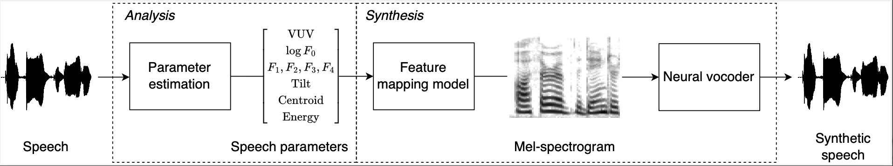

# Speaker-independent neural formant synthesis

##### [Pablo Pérez Zarazaga][pablo_profile], [Zofia Malisz][zofia_profile], [Gustav Eje Henter][gustav_profile], [Lauri Juvela][lauri_profile]

<head> 
<link rel="apple-touch-icon" sizes="180x180" href="favicon/apple-touch-icon.png">
<link rel="icon" type="image/png" sizes="32x32" href="favicon/favicon-32x32.png">
<link rel="icon" type="image/png" sizes="16x16" href="favicon/favicon-16x16.png">
<link rel="manifest" href="/site.webmanifest">
<link rel="mask-icon" href="/safari-pinned-tab.svg" color="#5bbad5">
<meta name="msapplication-TileColor" content="#da532c">
<meta name="theme-color" content="#ffffff">
</head>
<!-- This post presents CWAD, a deep-learning framework to automatically label large amounts of clean whispered speech, applied to ASMR recordings extracted from YouTube -->

[NF_link]: https://github.com/perezpoz/NeuralFormants
[WN_link]: https://github.com/ljuvela/GlotNet
[gustav_profile]: https://people.kth.se/~ghe/
[pablo_profile]: https://www.kth.se/profile/pablopz
[zofia_profile]: https://www.kth.se/profile/malisz
[lauri_profile]: https://research.aalto.fi/en/persons/lauri-juvela
[paper_link]: https://arxiv.org/abs/2303.07442
[hifi_link]: https://github.com/jik876/hifi-gan


## Citation information

```
@inproceedings{perez2023neuralformant,
   title={Speaker-independent neural formant synthesis},
   author={Pablo Pérez Zarazaga and Zofia Malisz and Gustav Eje Henter and Lauri Juvela},
   booktitle={Proc. ICASSP},
   year={2023}
 }
```

## Summary

The goal of this work is to develop a speaker-independent speech synthesis system driven by a small set of phonetically meaningful speech parameters.

The system provides a controllable environment where it is possible to manipulate the different individual speech parameters to generate 

## Visual overview



## Code

Neural formant network code and pre-trained models will be made available in [this GitHub repository][NF_link] shortly.
WaveNet code can be found in [this GitHub repository][WN_link].

<style type="text/css">
  .tg {
    border-collapse: collapse;
    border-color: #9ABAD9;
    border-spacing: 0;
  }

  .tg td {
    background-color: #EBF5FF;
    border-color: #9ABAD9;
    border-style: solid;
    border-width: 1px;
    color: #444;
    font-family: Arial, sans-serif;
    font-size: 14px;
    overflow: hidden;
    padding: 0px 20px;
    word-break: normal;
    font-weight: bold;
    vertical-align: middle;
  }

  .tg th {
    background-color: #409cff;
    border-color: #9ABAD9;
    border-style: solid;
    border-width: 1px;
    color: #fff;
    font-family: Arial, sans-serif;
    font-size: 14px;
    font-weight: normal;
    overflow: hidden;
    padding: 0px 20px;
    word-break: normal;
    font-weight: bold;
    vertical-align: middle;

  }

  .tg .tg-0pky {
    border-color: inherit;
    text-align: center;
    vertical-align: top,
  }

  .tg .tg-fymr {
    border-color: inherit;
    font-weight: bold;
    text-align: center;
    vertical-align: top
  }
  .slider {
  -webkit-appearance: none;
  width: 75%;
  height: 15px;
  border-radius: 5px;  
  background: #d3d3d3;
  outline: none;
  opacity: 0.7;
  -webkit-transition: .2s;
  transition: opacity .2s;
}

.slider::-webkit-slider-thumb {
  -webkit-appearance: none;
  appearance: none;
  width: 25px;
  height: 25px;
  border-radius: 50%; 
  background: #409cff;
  cursor: pointer;
}

.slider::-moz-range-thumb {
  width: 25px;
  height: 25px;
  border-radius: 50%;
  background: #409cff;
  cursor: pointer;
}
</style>

## Synthesised speech

The following audio samples have been synthesised with the different systems described in [our paper][paper_link]

<table class="tg">
  <thead>
    <tr>
      <th class="tg-0pky">System</th>
      <th class="tg-0pky" colspan="1">Reference</th>
      <th class="tg-0pky" colspan="1">HiFi-GAN</th>
      <th class="tg-0pky" colspan="1">NF + HiFi-GAN</th>
      <th class="tg-0pky" colspan="1">WaveNet</th>
      <th class="tg-0pky" colspan="1">NF + WaveNet</th>
    </tr>
  </thead>
  <tbody>
    <tr>
      <td nowrap="" class="tg-0pky"><b>Sample 1</b></td>
      <td class="tg-0pky">
        <audio id="audio-small" controls="">
          <source src="./Samples/NeuralFormants/CS/p257_016_Orig.wav" type="audio/wav" />
        </audio>
      </td>
      <td class="tg-0pky">
        <audio controls="">
          <source src="./Samples/NeuralFormants/CS/p257_016_HiFi.wav" type="audio/wav" />
        </audio>
      </td>
      <td class="tg-0pky">
        <audio controls="">
          <source src="./Samples/NeuralFormants/CS/p257_016_NFHifi.wav" type="audio/wav" />
        </audio>
      </td>
      <td class="tg-0pky">
        <audio controls="">
          <source src="./Samples/NeuralFormants/CS/p257_016_WaveNet.wav" type="audio/wav" />
        </audio>
      </td>
      <td class="tg-0pky">
        <audio controls="">
          <source src="./Samples/NeuralFormants/CS/p257_016_NFWaveNet.wav" type="audio/wav" />
        </audio>
      </td>
    </tr>
  </tbody>
  <tbody>
    <tr>
      <td nowrap="" class="tg-0pky"><b>Sample 2</b></td>
      <td class="tg-0pky">
        <audio id="audio-small" controls="">
          <source src="./Samples/NeuralFormants/CS/p260_021_Orig.wav" type="audio/wav" />
        </audio>
      </td>
      <td class="tg-0pky">
        <audio controls="">
          <source src="./Samples/NeuralFormants/CS/p260_021_HiFi.wav" type="audio/wav" />
        </audio>
      </td>
      <td class="tg-0pky">
        <audio controls="">
          <source src="./Samples/NeuralFormants/CS/p260_021_NFHifi.wav" type="audio/wav" />
        </audio>
      </td>
      <td class="tg-0pky">
        <audio controls="">
          <source src="./Samples/NeuralFormants/CS/p260_021_WaveNet.wav" type="audio/wav" />
        </audio>
      </td>
      <td class="tg-0pky">
        <audio controls="">
          <source src="./Samples/NeuralFormants/CS/p260_021_NFWaveNet.wav" type="audio/wav" />
        </audio>
      </td>
    </tr>
  </tbody>
  <tbody>
    <tr>
      <td nowrap="" class="tg-0pky"><b>Sample 3</b></td>
      <td class="tg-0pky">
        <audio id="audio-small" controls="">
          <source src="./Samples/NeuralFormants/CS/p263_011_Orig.wav" type="audio/wav" />
        </audio>
      </td>
      <td class="tg-0pky">
        <audio controls="">
          <source src="./Samples/NeuralFormants/CS/p263_011_HiFi.wav" type="audio/wav" />
        </audio>
      </td>
      <td class="tg-0pky">
        <audio controls="">
          <source src="./Samples/NeuralFormants/CS/p263_011_NFHifi.wav" type="audio/wav" />
        </audio>
      </td>
      <td class="tg-0pky">
        <audio controls="">
          <source src="./Samples/NeuralFormants/CS/p263_011_WaveNet.wav" type="audio/wav" />
        </audio>
      </td>
      <td class="tg-0pky">
        <audio controls="">
          <source src="./Samples/NeuralFormants/CS/p263_011_NFWaveNet.wav" type="audio/wav" />
        </audio>
      </td>
    </tr>
  </tbody>
  <tbody>
    <tr>
      <td nowrap="" class="tg-0pky"><b>Sample 4</b></td>
      <td class="tg-0pky">
        <audio id="audio-small" controls="">
          <source src="./Samples/NeuralFormants/CS/p266_006_Orig.wav" type="audio/wav" />
        </audio>
      </td>
      <td class="tg-0pky">
        <audio controls="">
          <source src="./Samples/NeuralFormants/CS/p266_006_HiFi.wav" type="audio/wav" />
        </audio>
      </td>
      <td class="tg-0pky">
        <audio controls="">
          <source src="./Samples/NeuralFormants/CS/p266_006_NFHifi.wav" type="audio/wav" />
        </audio>
      </td>
      <td class="tg-0pky">
        <audio controls="">
          <source src="./Samples/NeuralFormants/CS/p266_006_WaveNet.wav" type="audio/wav" />
        </audio>
      </td>
      <td class="tg-0pky">
        <audio controls="">
          <source src="./Samples/NeuralFormants/CS/p266_006_NFWaveNet.wav" type="audio/wav" />
        </audio>
      </td>
    </tr>
  </tbody>
  <tbody>
    <tr>
      <td nowrap="" class="tg-0pky"><b>Sample 5</b></td>
      <td class="tg-0pky">
        <audio id="audio-small" controls="">
          <source src="./Samples/NeuralFormants/CS/p277_071_Orig.wav" type="audio/wav" />
        </audio>
      </td>
      <td class="tg-0pky">
        <audio controls="">
          <source src="./Samples/NeuralFormants/CS/p277_071_HiFi.wav" type="audio/wav" />
        </audio>
      </td>
      <td class="tg-0pky">
        <audio controls="">
          <source src="./Samples/NeuralFormants/CS/p277_071_NFHifi.wav" type="audio/wav" />
        </audio>
      </td>
      <td class="tg-0pky">
        <audio controls="">
          <source src="./Samples/NeuralFormants/CS/p277_071_WaveNet.wav" type="audio/wav" />
        </audio>
      </td>
      <td class="tg-0pky">
        <audio controls="">
          <source src="./Samples/NeuralFormants/CS/p277_071_NFWaveNet.wav" type="audio/wav" />
        </audio>
      </td>
    </tr>
  </tbody>
  <tbody>
    <tr>
      <td nowrap="" class="tg-0pky"><b>Sample 6</b></td>
      <td class="tg-0pky">
        <audio id="audio-small" controls="">
          <source src="./Samples/NeuralFormants/CS/p280_019_Orig.wav" type="audio/wav" />
        </audio>
      </td>
      <td class="tg-0pky">
        <audio controls="">
          <source src="./Samples/NeuralFormants/CS/p280_019_HiFi.wav" type="audio/wav" />
        </audio>
      </td>
      <td class="tg-0pky">
        <audio controls="">
          <source src="./Samples/NeuralFormants/CS/p280_019_NFHifi.wav" type="audio/wav" />
        </audio>
      </td>
      <td class="tg-0pky">
        <audio controls="">
          <source src="./Samples/NeuralFormants/CS/p280_019_WaveNet.wav" type="audio/wav" />
        </audio>
      </td>
      <td class="tg-0pky">
        <audio controls="">
          <source src="./Samples/NeuralFormants/CS/p280_019_NFWaveNet.wav" type="audio/wav" />
        </audio>
      </td>
    </tr>
  </tbody>
  <tbody>
    <tr>
      <td nowrap="" class="tg-0pky"><b>Sample 7</b></td>
      <td class="tg-0pky">
        <audio id="audio-small" controls="">
          <source src="./Samples/NeuralFormants/CS/p282_015_Orig.wav" type="audio/wav" />
        </audio>
      </td>
      <td class="tg-0pky">
        <audio controls="">
          <source src="./Samples/NeuralFormants/CS/p282_015_HiFi.wav" type="audio/wav" />
        </audio>
      </td>
      <td class="tg-0pky">
        <audio controls="">
          <source src="./Samples/NeuralFormants/CS/p282_015_NFHifi.wav" type="audio/wav" />
        </audio>
      </td>
      <td class="tg-0pky">
        <audio controls="">
          <source src="./Samples/NeuralFormants/CS/p282_015_WaveNet.wav" type="audio/wav" />
        </audio>
      </td>
      <td class="tg-0pky">
        <audio controls="">
          <source src="./Samples/NeuralFormants/CS/p282_015_NFWaveNet.wav" type="audio/wav" />
        </audio>
      </td>
    </tr>
  </tbody>
  <tbody>
    <tr>
      <td nowrap="" class="tg-0pky"><b>Sample 8</b></td>
      <td class="tg-0pky">
        <audio id="audio-small" controls="">
          <source src="./Samples/NeuralFormants/CS/p285_005_Orig.wav" type="audio/wav" />
        </audio>
      </td>
      <td class="tg-0pky">
        <audio controls="">
          <source src="./Samples/NeuralFormants/CS/p285_005_HiFi.wav" type="audio/wav" />
        </audio>
      </td>
      <td class="tg-0pky">
        <audio controls="">
          <source src="./Samples/NeuralFormants/CS/p285_005_NFHifi.wav" type="audio/wav" />
        </audio>
      </td>
      <td class="tg-0pky">
        <audio controls="">
          <source src="./Samples/NeuralFormants/CS/p285_005_WaveNet.wav" type="audio/wav" />
        </audio>
      </td>
      <td class="tg-0pky">
        <audio controls="">
          <source src="./Samples/NeuralFormants/CS/p285_005_NFWaveNet.wav" type="audio/wav" />
        </audio>
      </td>
    </tr>
  </tbody>
  <tbody>
    <tr>
      <td nowrap="" class="tg-0pky"><b>Sample 9</b></td>
      <td class="tg-0pky">
        <audio id="audio-small" controls="">
          <source src="./Samples/NeuralFormants/CS/p304_003_Orig.wav" type="audio/wav" />
        </audio>
      </td>
      <td class="tg-0pky">
        <audio controls="">
          <source src="./Samples/NeuralFormants/CS/p304_003_HiFi.wav" type="audio/wav" />
        </audio>
      </td>
      <td class="tg-0pky">
        <audio controls="">
          <source src="./Samples/NeuralFormants/CS/p304_003_NFHifi.wav" type="audio/wav" />
        </audio>
      </td>
      <td class="tg-0pky">
        <audio controls="">
          <source src="./Samples/NeuralFormants/CS/p304_003_WaveNet.wav" type="audio/wav" />
        </audio>
      </td>
      <td class="tg-0pky">
        <audio controls="">
          <source src="./Samples/NeuralFormants/CS/p304_003_NFWaveNet.wav" type="audio/wav" />
        </audio>
      </td>
    </tr>
  </tbody>
  <tbody>
    <tr>
      <td nowrap="" class="tg-0pky"><b>Sample 10</b></td>
      <td class="tg-0pky">
        <audio id="audio-small" controls="">
          <source src="./Samples/NeuralFormants/CS/p333_022_Orig.wav" type="audio/wav" />
        </audio>
      </td>
      <td class="tg-0pky">
        <audio controls="">
          <source src="./Samples/NeuralFormants/CS/p333_022_HiFi.wav" type="audio/wav" />
        </audio>
      </td>
      <td class="tg-0pky">
        <audio controls="">
          <source src="./Samples/NeuralFormants/CS/p333_022_NFHifi.wav" type="audio/wav" />
        </audio>
      </td>
      <td class="tg-0pky">
        <audio controls="">
          <source src="./Samples/NeuralFormants/CS/p333_022_WaveNet.wav" type="audio/wav" />
        </audio>
      </td>
      <td class="tg-0pky">
        <audio controls="">
          <source src="./Samples/NeuralFormants/CS/p333_022_NFWaveNet.wav" type="audio/wav" />
        </audio>
      </td>
    </tr>
  </tbody>
</table>

In the manipulation task, we apply a constant scaling to a specific speech parameter over a whole synthesised utterance.

In the following audio samples, we have manipulated the fundamental frequency F0, and the formants F1 to F4 using the scaling values [0.7, 0.8, 0.9, 1.1, 1.2, 1.3].

<table class="tg">
  <thead>
    <tr>
      <th class="tg-0pky">Scale F0</th>
      <th class="tg-0pky" colspan="1">0.7</th>
      <th class="tg-0pky" colspan="1">0.8</th>
      <th class="tg-0pky" colspan="1">0.9</th>
      <th class="tg-0pky" colspan="1">1.1</th>
      <th class="tg-0pky" colspan="1">1.2</th>
      <th class="tg-0pky" colspan="1">1.3</th>
    </tr>
  </thead>
  <tbody>
    <tr>
      <td nowrap="" class="tg-0pky"><b>NF HiFi-GAN 1</b></td>
      <td class="tg-0pky">
        <audio id="audio-small" controls="">
          <source src="./Samples/NeuralFormants/Manipulation/NF_HifiGAN/F0_0.7/p260_021_mic1_80mel.wav" type="audio/wav" />
        </audio>
      </td>
      <td class="tg-0pky">
        <audio controls="">
          <source src="./Samples/NeuralFormants/Manipulation/NF_HifiGAN/F0_0.8/p260_021_mic1_80mel.wav" type="audio/wav" />
        </audio>
      </td>
      <td class="tg-0pky">
        <audio controls="">
          <source src="./Samples/NeuralFormants/Manipulation/NF_HifiGAN/F0_0.9/p260_021_mic1_80mel.wav" type="audio/wav" />
        </audio>
      </td>
      <td class="tg-0pky">
        <audio controls="">
          <source src="./Samples/NeuralFormants/Manipulation/NF_HifiGAN/F0_1.1/p260_021_mic1_80mel.wav" type="audio/wav" />
        </audio>
      </td>
      <td class="tg-0pky">
        <audio controls="">
          <source src="./Samples/NeuralFormants/Manipulation/NF_HifiGAN/F0_1.2/p260_021_mic1_80mel.wav" type="audio/wav" />
        </audio>
      </td>
      <td class="tg-0pky">
        <audio controls="">
          <source src="./Samples/NeuralFormants/Manipulation/NF_HifiGAN/F0_1.3/p260_021_mic1_80mel.wav" type="audio/wav" />
        </audio>
      </td>
    </tr>
  </tbody>
  <tbody>
    <tr>
      <td nowrap="" class="tg-0pky"><b>NF HiFi-GAN 2</b></td>
      <td class="tg-0pky">
        <audio id="audio-small" controls="">
          <source src="./Samples/NeuralFormants/Manipulation/NF_HifiGAN/F0_0.7/p282_006_mic1_80mel.wav" type="audio/wav" />
        </audio>
      </td>
      <td class="tg-0pky">
        <audio controls="">
          <source src="./Samples/NeuralFormants/Manipulation/NF_HifiGAN/F0_0.8/p282_006_mic1_80mel.wav" type="audio/wav" />
        </audio>
      </td>
      <td class="tg-0pky">
        <audio controls="">
          <source src="./Samples/NeuralFormants/Manipulation/NF_HifiGAN/F0_0.9/p282_006_mic1_80mel.wav" type="audio/wav" />
        </audio>
      </td>
      <td class="tg-0pky">
        <audio controls="">
          <source src="./Samples/NeuralFormants/Manipulation/NF_HifiGAN/F0_1.1/p282_006_mic1_80mel.wav" type="audio/wav" />
        </audio>
      </td>
      <td class="tg-0pky">
        <audio controls="">
          <source src="./Samples/NeuralFormants/Manipulation/NF_HifiGAN/F0_1.2/p282_006_mic1_80mel.wav" type="audio/wav" />
        </audio>
      </td>
      <td class="tg-0pky">
        <audio controls="">
          <source src="./Samples/NeuralFormants/Manipulation/NF_HifiGAN/F0_1.3/p282_006_mic1_80mel.wav" type="audio/wav" />
        </audio>
      </td>
    </tr>
  </tbody>
  <tbody>
    <tr>
      <td nowrap="" class="tg-0pky"><b>PRAAT 1</b></td>
      <td class="tg-0pky">
        <audio id="audio-small" controls="">
          <source src="./Samples/NeuralFormants/Manipulation/Praat/F0_0.7/p260_021_mic1_80mel.wav" type="audio/wav" />
        </audio>
      </td>
      <td class="tg-0pky">
        <audio controls="">
          <source src="./Samples/NeuralFormants/Manipulation/Praat/F0_0.8/p260_021_mic1_80mel.wav" type="audio/wav" />
        </audio>
      </td>
      <td class="tg-0pky">
        <audio controls="">
          <source src="./Samples/NeuralFormants/Manipulation/Praat/F0_0.9/p260_021_mic1_80mel.wav" type="audio/wav" />
        </audio>
      </td>
      <td class="tg-0pky">
        <audio controls="">
          <source src="./Samples/NeuralFormants/Manipulation/Praat/F0_1.1/p260_021_mic1_80mel.wav" type="audio/wav" />
        </audio>
      </td>
      <td class="tg-0pky">
        <audio controls="">
          <source src="./Samples/NeuralFormants/Manipulation/Praat/F0_1.2/p260_021_mic1_80mel.wav" type="audio/wav" />
        </audio>
      </td>
      <td class="tg-0pky">
        <audio controls="">
          <source src="./Samples/NeuralFormants/Manipulation/Praat/F0_1.3/p260_021_mic1_80mel.wav" type="audio/wav" />
        </audio>
      </td>
    </tr>
  </tbody>
  <tbody>
    <tr>
      <td nowrap="" class="tg-0pky"><b>PRAAT 2</b></td>
      <td class="tg-0pky">
        <audio id="audio-small" controls="">
          <source src="./Samples/NeuralFormants/Manipulation/Praat/F0_0.7/p282_006_mic1_80mel.wav" type="audio/wav" />
        </audio>
      </td>
      <td class="tg-0pky">
        <audio controls="">
          <source src="./Samples/NeuralFormants/Manipulation/Praat/F0_0.8/p282_006_mic1_80mel.wav" type="audio/wav" />
        </audio>
      </td>
      <td class="tg-0pky">
        <audio controls="">
          <source src="./Samples/NeuralFormants/Manipulation/Praat/F0_0.9/p282_006_mic1_80mel.wav" type="audio/wav" />
        </audio>
      </td>
      <td class="tg-0pky">
        <audio controls="">
          <source src="./Samples/NeuralFormants/Manipulation/Praat/F0_1.1/p282_006_mic1_80mel.wav" type="audio/wav" />
        </audio>
      </td>
      <td class="tg-0pky">
        <audio controls="">
          <source src="./Samples/NeuralFormants/Manipulation/Praat/F0_1.2/p282_006_mic1_80mel.wav" type="audio/wav" />
        </audio>
      </td>
      <td class="tg-0pky">
        <audio controls="">
          <source src="./Samples/NeuralFormants/Manipulation/Praat/F0_1.3/p282_006_mic1_80mel.wav" type="audio/wav" />
        </audio>
      </td>
    </tr>
  </tbody>
</table>

<table class="tg">
  <thead>
    <tr>
      <th class="tg-0pky">Scale F1</th>
      <th class="tg-0pky" colspan="1">0.7</th>
      <th class="tg-0pky" colspan="1">0.8</th>
      <th class="tg-0pky" colspan="1">0.9</th>
      <th class="tg-0pky" colspan="1">1.1</th>
      <th class="tg-0pky" colspan="1">1.2</th>
      <th class="tg-0pky" colspan="1">1.3</th>
    </tr>
  </thead>
  <tbody>
    <tr>
      <td nowrap="" class="tg-0pky"><b>NF HiFi-GAN 1</b></td>
      <td class="tg-0pky">
        <audio id="audio-small" controls="">
          <source src="./Samples/NeuralFormants/Manipulation/NF_HifiGAN/F1_0.7/p260_021_mic1_80mel.wav" type="audio/wav" />
        </audio>
      </td>
      <td class="tg-0pky">
        <audio controls="">
          <source src="./Samples/NeuralFormants/Manipulation/NF_HifiGAN/F1_0.8/p260_021_mic1_80mel.wav" type="audio/wav" />
        </audio>
      </td>
      <td class="tg-0pky">
        <audio controls="">
          <source src="./Samples/NeuralFormants/Manipulation/NF_HifiGAN/F1_0.9/p260_021_mic1_80mel.wav" type="audio/wav" />
        </audio>
      </td>
      <td class="tg-0pky">
        <audio controls="">
          <source src="./Samples/NeuralFormants/Manipulation/NF_HifiGAN/F1_1.1/p260_021_mic1_80mel.wav" type="audio/wav" />
        </audio>
      </td>
      <td class="tg-0pky">
        <audio controls="">
          <source src="./Samples/NeuralFormants/Manipulation/NF_HifiGAN/F1_1.2/p260_021_mic1_80mel.wav" type="audio/wav" />
        </audio>
      </td>
      <td class="tg-0pky">
        <audio controls="">
          <source src="./Samples/NeuralFormants/Manipulation/NF_HifiGAN/F1_1.3/p260_021_mic1_80mel.wav" type="audio/wav" />
        </audio>
      </td>
    </tr>
  </tbody>
  <tbody>
    <tr>
      <td nowrap="" class="tg-0pky"><b>NF HiFi-GAN 2</b></td>
      <td class="tg-0pky">
        <audio id="audio-small" controls="">
          <source src="./Samples/NeuralFormants/Manipulation/NF_HifiGAN/F1_0.7/p282_006_mic1_80mel.wav" type="audio/wav" />
        </audio>
      </td>
      <td class="tg-0pky">
        <audio controls="">
          <source src="./Samples/NeuralFormants/Manipulation/NF_HifiGAN/F1_0.8/p282_006_mic1_80mel.wav" type="audio/wav" />
        </audio>
      </td>
      <td class="tg-0pky">
        <audio controls="">
          <source src="./Samples/NeuralFormants/Manipulation/NF_HifiGAN/F1_0.9/p282_006_mic1_80mel.wav" type="audio/wav" />
        </audio>
      </td>
      <td class="tg-0pky">
        <audio controls="">
          <source src="./Samples/NeuralFormants/Manipulation/NF_HifiGAN/F1_1.1/p282_006_mic1_80mel.wav" type="audio/wav" />
        </audio>
      </td>
      <td class="tg-0pky">
        <audio controls="">
          <source src="./Samples/NeuralFormants/Manipulation/NF_HifiGAN/F1_1.2/p282_006_mic1_80mel.wav" type="audio/wav" />
        </audio>
      </td>
      <td class="tg-0pky">
        <audio controls="">
          <source src="./Samples/NeuralFormants/Manipulation/NF_HifiGAN/F1_1.3/p282_006_mic1_80mel.wav" type="audio/wav" />
        </audio>
      </td>
    </tr>
  </tbody>
  <tbody>
    <tr>
      <td nowrap="" class="tg-0pky"><b>PRAAT 1</b></td>
      <td class="tg-0pky">
        <audio id="audio-small" controls="">
          <source src="./Samples/NeuralFormants/Manipulation/Praat/F1_0.7/p260_021_mic1_80mel.wav" type="audio/wav" />
        </audio>
      </td>
      <td class="tg-0pky">
        <audio controls="">
          <source src="./Samples/NeuralFormants/Manipulation/Praat/F1_0.8/p260_021_mic1_80mel.wav" type="audio/wav" />
        </audio>
      </td>
      <td class="tg-0pky">
        <audio controls="">
          <source src="./Samples/NeuralFormants/Manipulation/Praat/F1_0.9/p260_021_mic1_80mel.wav" type="audio/wav" />
        </audio>
      </td>
      <td class="tg-0pky">
        <audio controls="">
          <source src="./Samples/NeuralFormants/Manipulation/Praat/F1_1.1/p260_021_mic1_80mel.wav" type="audio/wav" />
        </audio>
      </td>
      <td class="tg-0pky">
        <audio controls="">
          <source src="./Samples/NeuralFormants/Manipulation/Praat/F1_1.2/p260_021_mic1_80mel.wav" type="audio/wav" />
        </audio>
      </td>
      <td class="tg-0pky">
        <audio controls="">
          <source src="./Samples/NeuralFormants/Manipulation/Praat/F1_1.3/p260_021_mic1_80mel.wav" type="audio/wav" />
        </audio>
      </td>
    </tr>
  </tbody>
  <tbody>
    <tr>
      <td nowrap="" class="tg-0pky"><b>PRAAT 2</b></td>
      <td class="tg-0pky">
        <audio id="audio-small" controls="">
          <source src="./Samples/NeuralFormants/Manipulation/Praat/F1_0.7/p282_006_mic1_80mel.wav" type="audio/wav" />
        </audio>
      </td>
      <td class="tg-0pky">
        <audio controls="">
          <source src="./Samples/NeuralFormants/Manipulation/Praat/F1_0.8/p282_006_mic1_80mel.wav" type="audio/wav" />
        </audio>
      </td>
      <td class="tg-0pky">
        <audio controls="">
          <source src="./Samples/NeuralFormants/Manipulation/Praat/F1_0.9/p282_006_mic1_80mel.wav" type="audio/wav" />
        </audio>
      </td>
      <td class="tg-0pky">
        <audio controls="">
          <source src="./Samples/NeuralFormants/Manipulation/Praat/F1_1.1/p282_006_mic1_80mel.wav" type="audio/wav" />
        </audio>
      </td>
      <td class="tg-0pky">
        <audio controls="">
          <source src="./Samples/NeuralFormants/Manipulation/Praat/F1_1.2/p282_006_mic1_80mel.wav" type="audio/wav" />
        </audio>
      </td>
      <td class="tg-0pky">
        <audio controls="">
          <source src="./Samples/NeuralFormants/Manipulation/Praat/F1_1.3/p282_006_mic1_80mel.wav" type="audio/wav" />
        </audio>
      </td>
    </tr>
  </tbody>
</table>

<table class="tg">
  <thead>
    <tr>
      <th class="tg-0pky">Scale F2</th>
      <th class="tg-0pky" colspan="1">0.7</th>
      <th class="tg-0pky" colspan="1">0.8</th>
      <th class="tg-0pky" colspan="1">0.9</th>
      <th class="tg-0pky" colspan="1">1.1</th>
      <th class="tg-0pky" colspan="1">1.2</th>
      <th class="tg-0pky" colspan="1">1.3</th>
    </tr>
  </thead>
  <tbody>
    <tr>
      <td nowrap="" class="tg-0pky"><b>NF HiFi-GAN 1</b></td>
      <td class="tg-0pky">
        <audio id="audio-small" controls="">
          <source src="./Samples/NeuralFormants/Manipulation/NF_HifiGAN/F2_0.7/p260_021_mic1_80mel.wav" type="audio/wav" />
        </audio>
      </td>
      <td class="tg-0pky">
        <audio controls="">
          <source src="./Samples/NeuralFormants/Manipulation/NF_HifiGAN/F2_0.8/p260_021_mic1_80mel.wav" type="audio/wav" />
        </audio>
      </td>
      <td class="tg-0pky">
        <audio controls="">
          <source src="./Samples/NeuralFormants/Manipulation/NF_HifiGAN/F2_0.9/p260_021_mic1_80mel.wav" type="audio/wav" />
        </audio>
      </td>
      <td class="tg-0pky">
        <audio controls="">
          <source src="./Samples/NeuralFormants/Manipulation/NF_HifiGAN/F2_1.1/p260_021_mic1_80mel.wav" type="audio/wav" />
        </audio>
      </td>
      <td class="tg-0pky">
        <audio controls="">
          <source src="./Samples/NeuralFormants/Manipulation/NF_HifiGAN/F2_1.2/p260_021_mic1_80mel.wav" type="audio/wav" />
        </audio>
      </td>
      <td class="tg-0pky">
        <audio controls="">
          <source src="./Samples/NeuralFormants/Manipulation/NF_HifiGAN/F2_1.3/p260_021_mic1_80mel.wav" type="audio/wav" />
        </audio>
      </td>
    </tr>
  </tbody>
  <tbody>
    <tr>
      <td nowrap="" class="tg-0pky"><b>NF HiFi-GAN 2</b></td>
      <td class="tg-0pky">
        <audio id="audio-small" controls="">
          <source src="./Samples/NeuralFormants/Manipulation/NF_HifiGAN/F2_0.7/p282_006_mic1_80mel.wav" type="audio/wav" />
        </audio>
      </td>
      <td class="tg-0pky">
        <audio controls="">
          <source src="./Samples/NeuralFormants/Manipulation/NF_HifiGAN/F2_0.8/p282_006_mic1_80mel.wav" type="audio/wav" />
        </audio>
      </td>
      <td class="tg-0pky">
        <audio controls="">
          <source src="./Samples/NeuralFormants/Manipulation/NF_HifiGAN/F2_0.9/p282_006_mic1_80mel.wav" type="audio/wav" />
        </audio>
      </td>
      <td class="tg-0pky">
        <audio controls="">
          <source src="./Samples/NeuralFormants/Manipulation/NF_HifiGAN/F2_1.1/p282_006_mic1_80mel.wav" type="audio/wav" />
        </audio>
      </td>
      <td class="tg-0pky">
        <audio controls="">
          <source src="./Samples/NeuralFormants/Manipulation/NF_HifiGAN/F2_1.2/p282_006_mic1_80mel.wav" type="audio/wav" />
        </audio>
      </td>
      <td class="tg-0pky">
        <audio controls="">
          <source src="./Samples/NeuralFormants/Manipulation/NF_HifiGAN/F2_1.3/p282_006_mic1_80mel.wav" type="audio/wav" />
        </audio>
      </td>
    </tr>
  </tbody>
  <tbody>
    <tr>
      <td nowrap="" class="tg-0pky"><b>PRAAT 1</b></td>
      <td class="tg-0pky">
        <audio id="audio-small" controls="">
          <source src="./Samples/NeuralFormants/Manipulation/Praat/F2_0.7/p260_021_mic1_80mel.wav" type="audio/wav" />
        </audio>
      </td>
      <td class="tg-0pky">
        <audio controls="">
          <source src="./Samples/NeuralFormants/Manipulation/Praat/F2_0.8/p260_021_mic1_80mel.wav" type="audio/wav" />
        </audio>
      </td>
      <td class="tg-0pky">
        <audio controls="">
          <source src="./Samples/NeuralFormants/Manipulation/Praat/F2_0.9/p260_021_mic1_80mel.wav" type="audio/wav" />
        </audio>
      </td>
      <td class="tg-0pky">
        <audio controls="">
          <source src="./Samples/NeuralFormants/Manipulation/Praat/F2_1.1/p260_021_mic1_80mel.wav" type="audio/wav" />
        </audio>
      </td>
      <td class="tg-0pky">
        <audio controls="">
          <source src="./Samples/NeuralFormants/Manipulation/Praat/F2_1.2/p260_021_mic1_80mel.wav" type="audio/wav" />
        </audio>
      </td>
      <td class="tg-0pky">
        <audio controls="">
          <source src="./Samples/NeuralFormants/Manipulation/Praat/F2_1.3/p260_021_mic1_80mel.wav" type="audio/wav" />
        </audio>
      </td>
    </tr>
  </tbody>
  <tbody>
    <tr>
      <td nowrap="" class="tg-0pky"><b>PRAAT 2</b></td>
      <td class="tg-0pky">
        <audio id="audio-small" controls="">
          <source src="./Samples/NeuralFormants/Manipulation/Praat/F2_0.7/p282_006_mic1_80mel.wav" type="audio/wav" />
        </audio>
      </td>
      <td class="tg-0pky">
        <audio controls="">
          <source src="./Samples/NeuralFormants/Manipulation/Praat/F2_0.8/p282_006_mic1_80mel.wav" type="audio/wav" />
        </audio>
      </td>
      <td class="tg-0pky">
        <audio controls="">
          <source src="./Samples/NeuralFormants/Manipulation/Praat/F2_0.9/p282_006_mic1_80mel.wav" type="audio/wav" />
        </audio>
      </td>
      <td class="tg-0pky">
        <audio controls="">
          <source src="./Samples/NeuralFormants/Manipulation/Praat/F2_1.1/p282_006_mic1_80mel.wav" type="audio/wav" />
        </audio>
      </td>
      <td class="tg-0pky">
        <audio controls="">
          <source src="./Samples/NeuralFormants/Manipulation/Praat/F2_1.2/p282_006_mic1_80mel.wav" type="audio/wav" />
        </audio>
      </td>
      <td class="tg-0pky">
        <audio controls="">
          <source src="./Samples/NeuralFormants/Manipulation/Praat/F2_1.3/p282_006_mic1_80mel.wav" type="audio/wav" />
        </audio>
      </td>
    </tr>
  </tbody>
</table>

<table class="tg">
  <thead>
    <tr>
      <th class="tg-0pky">Scale F3</th>
      <th class="tg-0pky" colspan="1">0.7</th>
      <th class="tg-0pky" colspan="1">0.8</th>
      <th class="tg-0pky" colspan="1">0.9</th>
      <th class="tg-0pky" colspan="1">1.1</th>
      <th class="tg-0pky" colspan="1">1.2</th>
      <th class="tg-0pky" colspan="1">1.3</th>
    </tr>
  </thead>
  <tbody>
    <tr>
      <td nowrap="" class="tg-0pky"><b>NF HiFi-GAN 1</b></td>
      <td class="tg-0pky">
        <audio id="audio-small" controls="">
          <source src="./Samples/NeuralFormants/Manipulation/NF_HifiGAN/F3_0.7/p260_021_mic1_80mel.wav" type="audio/wav" />
        </audio>
      </td>
      <td class="tg-0pky">
        <audio controls="">
          <source src="./Samples/NeuralFormants/Manipulation/NF_HifiGAN/F3_0.8/p260_021_mic1_80mel.wav" type="audio/wav" />
        </audio>
      </td>
      <td class="tg-0pky">
        <audio controls="">
          <source src="./Samples/NeuralFormants/Manipulation/NF_HifiGAN/F3_0.9/p260_021_mic1_80mel.wav" type="audio/wav" />
        </audio>
      </td>
      <td class="tg-0pky">
        <audio controls="">
          <source src="./Samples/NeuralFormants/Manipulation/NF_HifiGAN/F3_1.1/p260_021_mic1_80mel.wav" type="audio/wav" />
        </audio>
      </td>
      <td class="tg-0pky">
        <audio controls="">
          <source src="./Samples/NeuralFormants/Manipulation/NF_HifiGAN/F3_1.2/p260_021_mic1_80mel.wav" type="audio/wav" />
        </audio>
      </td>
      <td class="tg-0pky">
        <audio controls="">
          <source src="./Samples/NeuralFormants/Manipulation/NF_HifiGAN/F3_1.3/p260_021_mic1_80mel.wav" type="audio/wav" />
        </audio>
      </td>
    </tr>
  </tbody>
  <tbody>
    <tr>
      <td nowrap="" class="tg-0pky"><b>NF HiFi-GAN 2</b></td>
      <td class="tg-0pky">
        <audio id="audio-small" controls="">
          <source src="./Samples/NeuralFormants/Manipulation/NF_HifiGAN/F3_0.7/p282_006_mic1_80mel.wav" type="audio/wav" />
        </audio>
      </td>
      <td class="tg-0pky">
        <audio controls="">
          <source src="./Samples/NeuralFormants/Manipulation/NF_HifiGAN/F3_0.8/p282_006_mic1_80mel.wav" type="audio/wav" />
        </audio>
      </td>
      <td class="tg-0pky">
        <audio controls="">
          <source src="./Samples/NeuralFormants/Manipulation/NF_HifiGAN/F3_0.9/p282_006_mic1_80mel.wav" type="audio/wav" />
        </audio>
      </td>
      <td class="tg-0pky">
        <audio controls="">
          <source src="./Samples/NeuralFormants/Manipulation/NF_HifiGAN/F3_1.1/p282_006_mic1_80mel.wav" type="audio/wav" />
        </audio>
      </td>
      <td class="tg-0pky">
        <audio controls="">
          <source src="./Samples/NeuralFormants/Manipulation/NF_HifiGAN/F3_1.2/p282_006_mic1_80mel.wav" type="audio/wav" />
        </audio>
      </td>
      <td class="tg-0pky">
        <audio controls="">
          <source src="./Samples/NeuralFormants/Manipulation/NF_HifiGAN/F3_1.3/p282_006_mic1_80mel.wav" type="audio/wav" />
        </audio>
      </td>
    </tr>
  </tbody>
  <tbody>
    <tr>
      <td nowrap="" class="tg-0pky"><b>PRAAT 1</b></td>
      <td class="tg-0pky">
        <audio id="audio-small" controls="">
          <source src="./Samples/NeuralFormants/Manipulation/Praat/F3_0.7/p260_021_mic1_80mel.wav" type="audio/wav" />
        </audio>
      </td>
      <td class="tg-0pky">
        <audio controls="">
          <source src="./Samples/NeuralFormants/Manipulation/Praat/F3_0.8/p260_021_mic1_80mel.wav" type="audio/wav" />
        </audio>
      </td>
      <td class="tg-0pky">
        <audio controls="">
          <source src="./Samples/NeuralFormants/Manipulation/Praat/F3_0.9/p260_021_mic1_80mel.wav" type="audio/wav" />
        </audio>
      </td>
      <td class="tg-0pky">
        <audio controls="">
          <source src="./Samples/NeuralFormants/Manipulation/Praat/F3_1.1/p260_021_mic1_80mel.wav" type="audio/wav" />
        </audio>
      </td>
      <td class="tg-0pky">
        <audio controls="">
          <source src="./Samples/NeuralFormants/Manipulation/Praat/F3_1.2/p260_021_mic1_80mel.wav" type="audio/wav" />
        </audio>
      </td>
      <td class="tg-0pky">
        <audio controls="">
          <source src="./Samples/NeuralFormants/Manipulation/Praat/F3_1.3/p260_021_mic1_80mel.wav" type="audio/wav" />
        </audio>
      </td>
    </tr>
  </tbody>
  <tbody>
    <tr>
      <td nowrap="" class="tg-0pky"><b>PRAAT 2</b></td>
      <td class="tg-0pky">
        <audio id="audio-small" controls="">
          <source src="./Samples/NeuralFormants/Manipulation/Praat/F3_0.7/p282_006_mic1_80mel.wav" type="audio/wav" />
        </audio>
      </td>
      <td class="tg-0pky">
        <audio controls="">
          <source src="./Samples/NeuralFormants/Manipulation/Praat/F3_0.8/p282_006_mic1_80mel.wav" type="audio/wav" />
        </audio>
      </td>
      <td class="tg-0pky">
        <audio controls="">
          <source src="./Samples/NeuralFormants/Manipulation/Praat/F3_0.9/p282_006_mic1_80mel.wav" type="audio/wav" />
        </audio>
      </td>
      <td class="tg-0pky">
        <audio controls="">
          <source src="./Samples/NeuralFormants/Manipulation/Praat/F3_1.1/p282_006_mic1_80mel.wav" type="audio/wav" />
        </audio>
      </td>
      <td class="tg-0pky">
        <audio controls="">
          <source src="./Samples/NeuralFormants/Manipulation/Praat/F3_1.2/p282_006_mic1_80mel.wav" type="audio/wav" />
        </audio>
      </td>
      <td class="tg-0pky">
        <audio controls="">
          <source src="./Samples/NeuralFormants/Manipulation/Praat/F3_1.3/p282_006_mic1_80mel.wav" type="audio/wav" />
        </audio>
      </td>
    </tr>
  </tbody>
</table>

<table class="tg">
  <thead>
    <tr>
      <th class="tg-0pky">Scale F4</th>
      <th class="tg-0pky" colspan="1">0.7</th>
      <th class="tg-0pky" colspan="1">0.8</th>
      <th class="tg-0pky" colspan="1">0.9</th>
      <th class="tg-0pky" colspan="1">1.1</th>
      <th class="tg-0pky" colspan="1">1.2</th>
      <th class="tg-0pky" colspan="1">1.3</th>
    </tr>
  </thead>
  <tbody>
    <tr>
      <td nowrap="" class="tg-0pky"><b>NF HiFi-GAN 1</b></td>
      <td class="tg-0pky">
        <audio id="audio-small" controls="">
          <source src="./Samples/NeuralFormants/Manipulation/NF_HifiGAN/F4_0.7/p260_021_mic1_80mel.wav" type="audio/wav" />
        </audio>
      </td>
      <td class="tg-0pky">
        <audio controls="">
          <source src="./Samples/NeuralFormants/Manipulation/NF_HifiGAN/F4_0.8/p260_021_mic1_80mel.wav" type="audio/wav" />
        </audio>
      </td>
      <td class="tg-0pky">
        <audio controls="">
          <source src="./Samples/NeuralFormants/Manipulation/NF_HifiGAN/F4_0.9/p260_021_mic1_80mel.wav" type="audio/wav" />
        </audio>
      </td>
      <td class="tg-0pky">
        <audio controls="">
          <source src="./Samples/NeuralFormants/Manipulation/NF_HifiGAN/F4_1.1/p260_021_mic1_80mel.wav" type="audio/wav" />
        </audio>
      </td>
      <td class="tg-0pky">
        <audio controls="">
          <source src="./Samples/NeuralFormants/Manipulation/NF_HifiGAN/F4_1.2/p260_021_mic1_80mel.wav" type="audio/wav" />
        </audio>
      </td>
      <td class="tg-0pky">
        <audio controls="">
          <source src="./Samples/NeuralFormants/Manipulation/NF_HifiGAN/F4_1.3/p260_021_mic1_80mel.wav" type="audio/wav" />
        </audio>
      </td>
    </tr>
  </tbody>
  <tbody>
    <tr>
      <td nowrap="" class="tg-0pky"><b>NF HiFi-GAN 2</b></td>
      <td class="tg-0pky">
        <audio id="audio-small" controls="">
          <source src="./Samples/NeuralFormants/Manipulation/NF_HifiGAN/F4_0.7/p282_006_mic1_80mel.wav" type="audio/wav" />
        </audio>
      </td>
      <td class="tg-0pky">
        <audio controls="">
          <source src="./Samples/NeuralFormants/Manipulation/NF_HifiGAN/F4_0.8/p282_006_mic1_80mel.wav" type="audio/wav" />
        </audio>
      </td>
      <td class="tg-0pky">
        <audio controls="">
          <source src="./Samples/NeuralFormants/Manipulation/NF_HifiGAN/F4_0.9/p282_006_mic1_80mel.wav" type="audio/wav" />
        </audio>
      </td>
      <td class="tg-0pky">
        <audio controls="">
          <source src="./Samples/NeuralFormants/Manipulation/NF_HifiGAN/F4_1.1/p282_006_mic1_80mel.wav" type="audio/wav" />
        </audio>
      </td>
      <td class="tg-0pky">
        <audio controls="">
          <source src="./Samples/NeuralFormants/Manipulation/NF_HifiGAN/F4_1.2/p282_006_mic1_80mel.wav" type="audio/wav" />
        </audio>
      </td>
      <td class="tg-0pky">
        <audio controls="">
          <source src="./Samples/NeuralFormants/Manipulation/NF_HifiGAN/F4_1.3/p282_006_mic1_80mel.wav" type="audio/wav" />
        </audio>
      </td>
    </tr>
  </tbody>
  <tbody>
    <tr>
      <td nowrap="" class="tg-0pky"><b>PRAAT 1</b></td>
      <td class="tg-0pky">
        <audio id="audio-small" controls="">
          <source src="./Samples/NeuralFormants/Manipulation/Praat/F4_0.7/p260_021_mic1_80mel.wav" type="audio/wav" />
        </audio>
      </td>
      <td class="tg-0pky">
        <audio controls="">
          <source src="./Samples/NeuralFormants/Manipulation/Praat/F4_0.8/p260_021_mic1_80mel.wav" type="audio/wav" />
        </audio>
      </td>
      <td class="tg-0pky">
        <audio controls="">
          <source src="./Samples/NeuralFormants/Manipulation/Praat/F4_0.9/p260_021_mic1_80mel.wav" type="audio/wav" />
        </audio>
      </td>
      <td class="tg-0pky">
        <audio controls="">
          <source src="./Samples/NeuralFormants/Manipulation/Praat/F4_1.1/p260_021_mic1_80mel.wav" type="audio/wav" />
        </audio>
      </td>
      <td class="tg-0pky">
        <audio controls="">
          <source src="./Samples/NeuralFormants/Manipulation/Praat/F4_1.2/p260_021_mic1_80mel.wav" type="audio/wav" />
        </audio>
      </td>
      <td class="tg-0pky">
        <audio controls="">
          <source src="./Samples/NeuralFormants/Manipulation/Praat/F4_1.3/p260_021_mic1_80mel.wav" type="audio/wav" />
        </audio>
      </td>
    </tr>
  </tbody>
  <tbody>
    <tr>
      <td nowrap="" class="tg-0pky"><b>PRAAT 2</b></td>
      <td class="tg-0pky">
        <audio id="audio-small" controls="">
          <source src="./Samples/NeuralFormants/Manipulation/Praat/F4_0.7/p282_006_mic1_80mel.wav" type="audio/wav" />
        </audio>
      </td>
      <td class="tg-0pky">
        <audio controls="">
          <source src="./Samples/NeuralFormants/Manipulation/Praat/F4_0.8/p282_006_mic1_80mel.wav" type="audio/wav" />
        </audio>
      </td>
      <td class="tg-0pky">
        <audio controls="">
          <source src="./Samples/NeuralFormants/Manipulation/Praat/F4_0.9/p282_006_mic1_80mel.wav" type="audio/wav" />
        </audio>
      </td>
      <td class="tg-0pky">
        <audio controls="">
          <source src="./Samples/NeuralFormants/Manipulation/Praat/F4_1.1/p282_006_mic1_80mel.wav" type="audio/wav" />
        </audio>
      </td>
      <td class="tg-0pky">
        <audio controls="">
          <source src="./Samples/NeuralFormants/Manipulation/Praat/F4_1.2/p282_006_mic1_80mel.wav" type="audio/wav" />
        </audio>
      </td>
      <td class="tg-0pky">
        <audio controls="">
          <source src="./Samples/NeuralFormants/Manipulation/Praat/F4_1.3/p282_006_mic1_80mel.wav" type="audio/wav" />
        </audio>
      </td>
    </tr>
  </tbody>
</table>

[](https://hits.seeyoufarm.com)
